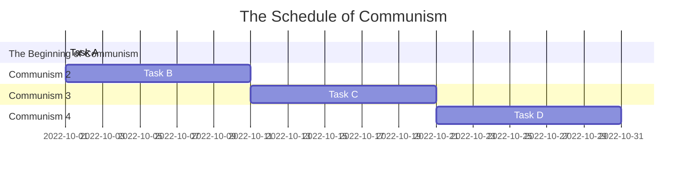

# Group 2  Communism
***
| Position     | Member             | Work     |
| :----------- | :---------------| :---------- |
| 組長         | C109118214 朱晉瑭 |  資料蒐集、資料處理、 內容編整、 問卷製作、發放問卷、聯絡負責人、網頁製作、統整討論資料、簡報製作   |
| 組長         | C109118226 林志穎 |  資料蒐集、資料處理、 內容編整、 問卷製作、發放問卷、聯絡負責人、網頁製作、統整討論資料、簡報製作   |
| 組長         | C109118227 謝岷翰 |  資料蒐集、資料處理、 內容編整、 問卷製作、發放問卷、聯絡負責人、網頁製作、統整討論資料、簡報製作   |
| 組長         | C109118236 劉　議 |  資料蒐集、資料處理、 內容編整、 問卷製作、發放問卷、聯絡負責人、網頁製作、統整討論資料、簡報製作   |
| 組長         | C109118244 袁祥竣 |  資料蒐集、資料處理、 內容編整、 問卷製作、發放問卷、聯絡負責人、網頁製作、統整討論資料、簡報製作   |
***

### Mermaid

