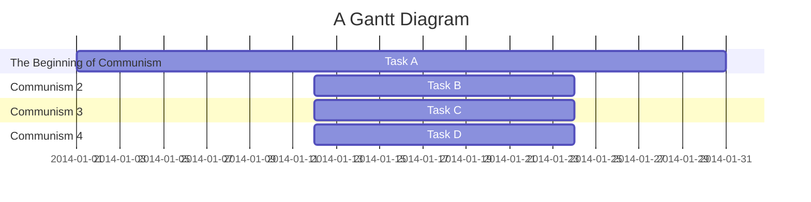

# Group 2  Communism
***
| Position     | Member             | Work     |
| :----------- | :---------------| :---------- |
| 組長         | C109118214 朱晉瑭 |     |
| 組長         | C109118226 林志穎 |     |
| 組長         | C109118227 謝岷翰 |     |
| 組長         | C109118236 劉　議 |     |
| 組長         | C109118244 袁祥竣 |     |
***

### Mermaid

