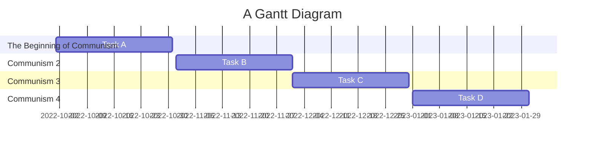

# Group 2  Communism
***
| Position     | Member             | Work     |
| :----------- | :---------------| :---------- |
| 組長         | C109118214 [朱晉瑭](https://github.com/C109118214) |     |
| 組長         | C109118226 [林志穎](https://github.com/ZYLinked) |     |
| 組長         | C109118227 [謝岷翰]( |     |
| 組長         | C109118236 [劉　議]( |     |
| 組長         | C109118244 [袁祥竣](https://github.com/C109118244) |     |
***

### Mermaid

