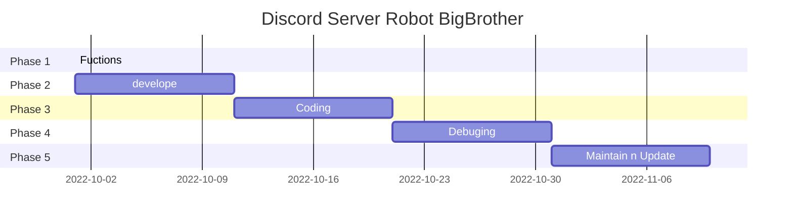
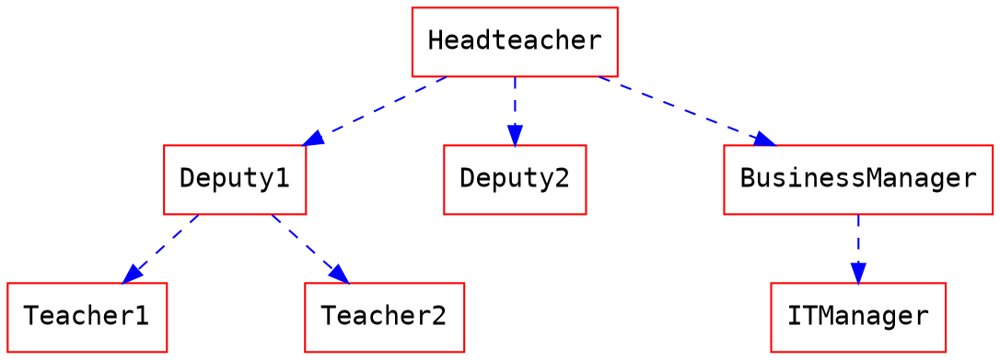
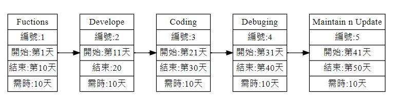

### 作業一
顯示在小組的github 上，請列出專案的組長與組員之姓名，個別組員的任務，專題題目，內容，甘特圖與PERT/CPM圖

# Group 2  Communism
***
| Position     | Member             | Work     |
| :----------- | :---------------| :---------- |
| 組員         | C109118214 [朱晉瑭](https://github.com/C109118214) |簡報製作、圖表繪製、影片拍攝|
| 組員         | C109118226 [林志穎](https://github.com/ZYLinked) |統整討論資料、功能設計、簡報講解|
| 組長       | C109118227 [謝岷翰](https://github.com/C109118227) |簡報製作、圖表繪製、影片剪輯|
| 組員         | C109118236 [劉　議](https://github.com/C109118236) |統整討論資料、圖表繪製、影片講解|
| 組員         | C109118244 [袁祥竣](https://github.com/C109118244) |功能設計、程式編寫、程式除錯|
***

# 題目:Discord 聊天機器人 BigBrother
### 目的:透過新增BigBrother來管理Discord伺服器的成員，並提供小遊戲、指令回應、用戶管理等功能代為管理伺服器創建者進行管理和服務。
### 說明:以下為設置功能
#### 1 標註用戶，機器人位根據成員標註誰並隨機選取一張照片傳給被標註成員以增進感情
#### 2 小遊戲: 猜拳、21點、俄羅斯輪盤、猜數字
#### 3 禁止玩家洗頻，偵測伺服器成員在一定時間內傳過多訊息將其禁言
#### 4 指令回應: 抓取網圖、訊息過濾、用戶查詢
#### 5 用戶管理: 隨機分配小組等功能

### Discord Bot

