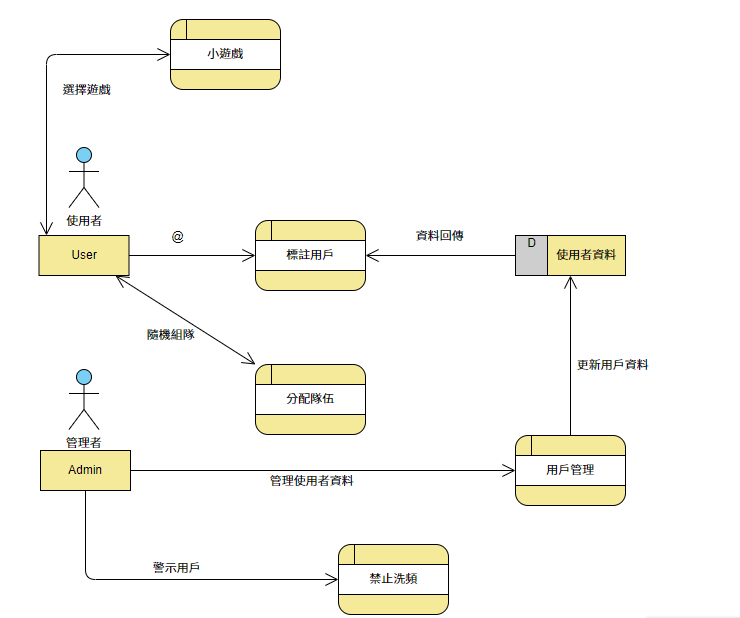

一、
功能性需求：

1.輸入連結撥放音樂

2.對特定關鍵字回應

3.分配隊伍

非功能性需求：

1.維護性佳，可便於新增或減少功能

2.高可靠度，系統指令執行失敗率低

3.高使用性，使用者訓練時間短

二、

三、
1. 管理者可以藉由個人資料標註用戶
2. 管理者可依隊伍數量與人數決定該進行的小遊戲
3. 當使用者的一段時間內的訊息數量過多會被系統禁止發送訊息
4. 使用者利用用戶管理以進行隊伍分配
5. 使用者輸入預設指令將得到相關的系統回應

四、

五、

[Figma](https://www.figma.com/file/7ouNBdzTyTabC7607W8j0c/%F0%9F%91%BE-Discord-(Community)?node-id=0%3A1)
